# 👋 Hi, I'm **Parth Tiwari**

<div align="center">


[](https://www.linkedin.com/in/parth-tiwar1)
[](mailto:parthti2003@gmail.com)
[](https://github.com/parthtiwari-dev)
[](https://github.com/parthtiwari-dev)

</div>

---

## 🚀 **About Me**

> **Building intelligent systems that solve real problems, not just completing tutorials.**

I'm an **Aspiring AI Engineer** specializing in **production-ready applications** spanning **workflow automation**, **fraud detection**, **e-commerce simulation**, and **advanced data analytics**. My latest project **FlowForge** demonstrates advanced system design and automation capabilities, showcasing skills in workflow orchestration and enterprise-grade Python architecture.

```python
class ParthTiwari:
    def __init__(self):
        self.location = "Bengaluru, India 📍"
        self.role = "Aspiring AI Engineer"
        self.focus = ["Workflow Automation", "Python Systems", "Fraud Detection", "SQL Analytics", "GenAI"]
        self.latest_project = "Machine Learning & Traffic Prediction + FlowForge Workflows"
        self.goal = "Building end-to-end AI products that scale"
        
    def current_status(self):
        return "Open to AI Engineer opportunities and collaborations 🤝"
```

---

## 🛠️ **Tech Stack & Expertise**

<div align="center">

### **Languages & Frameworks**


### **Databases & Tools**


### **Specializations**


</div>

**Core Competencies:**
- • 🎯 **Programming & Architecture:** Python (Advanced), OOP Design, Design Patterns, Clean Architecture
- • 📊 **Data & Analytics:** SQL (MySQL/PostgreSQL), Data Modeling, Business Intelligence, ETL Pipelines
- • 🤖 **AI/ML & Frameworks:** Fraud Detection Systems, Data Validation (Pydantic), Statistical Analysis, GenAI Tools
- • ⚙️ **Workflow Automation:** Orchestration Engines, Task Scheduling, Pipeline Design, System Integration
- • 🔧 **Development & Testing:** Git/GitHub, Testing (pytest), CI/CD, Performance Optimization, Stress Testing
- • ⚙️ **Specialized Systems:** Transaction Processing, Schema Design, Rule Engines, Real-time Analytics

---

## 🚀 **Featured Projects**

<div align="center">

[](https://github.com/parthtiwari-dev/fraudx)
[](https://github.com/parthtiwari-dev/FlowForge)
[](https://github.com/parthtiwari-dev/E-commerce-Simulation-System)

</div>

### 🏆 **Project Highlights**

| Project | Description | Key Features |
|---------|-------------|-------------|
| **⚡ [FlowForge](https://github.com/parthtiwari-dev/FlowForge)** | **LATEST:** Advanced workflow orchestration engine | Modular architecture, Task scheduling, Pipeline automation, Enterprise design patterns |
| **🔍 [FraudX](https://github.com/parthtiwari-dev/fraudx)** | Production-grade fraud detection engine | Configurable rules, Schema validation, Real-time processing |
| **🛒 [E-commerce Simulation](https://github.com/parthtiwari-dev/E-commerce-Simulation-System)** | Enterprise-level Python system | OOP patterns, <100ms response times, Stress testing |
| **📈 [SQL Analytics Portfolio](https://github.com/parthtiwari-dev/sql-olist-analytics-foundation)** | Advanced business intelligence projects | Brazilian e-commerce analysis, Complex queries, CTEs |
| **🚦 [Bangalore Traffic Wasted Time Prediction](https://github.com/parthtiwari-dev/bangalore-traffic-wasted-time-prediction)** | Practical ML regression project on urban traffic data | Real-world problem framing, Feature engineering, Linear/Ridge/Lasso regression from scratch, Model evaluation |
| **🧠 [ML From Scratch](https://github.com/parthtiwari-dev/ml-from-scratch)** | Building ML algorithms from first principles | Linear regression implementation, Multivariate regression, NumPy-based implementations, Educational ML fundamentals |
| **🤖 [AI Engineering Journey](https://github.com/parthtiwari-dev/AI-Engineer-Journey)** | Live ML/GenAI documentation | Practical implementations, System design patterns |
| **🎬 [IMDb SQL Challenges](https://github.com/parthtiwari-dev/IMDb-SQL-Practice-Project)** | Interview-ready SQL problems | 40+ challenges, Window functions, Advanced analytics |

---

## 📊 **GitHub Analytics**

<div align="center">

  


</div


| Metric | Count | Description |
|--------|-------|-------------|
| 🏗️ **Production Projects** | `6+` | Spanning workflow automation to fraud detection systems |
| 📈 **SQL Challenges Solved** | `40+` | Real-world datasets and interview problems |
| 🔧 **System Performance** | `<100ms` | Response times with 90%+ cache hit rates |
| 📝 **Documentation** | `Live` | AI engineering journey with practical implementations |

---

## 🛣️ **Learning Journey & Roadmap**

```mermaid
graph LR
    A[Python Systems] --> B[Fraud Detection]
    B --> C[Advanced SQL Analytics]
    C --> D[Workflow Automation]
    D --> E[GenAI Integration]
    E --> F[Deep Learning Applications]
    F --> G[MLOps & Deployment]
    G --> H[Real-time AI Services]
    
    style A fill:#f9f,stroke:#333,stroke-width:2px
    style D fill:#4ECDC4,stroke:#333,stroke-width:3px
    style E fill:#bbf,stroke:#333,stroke-width:2px
    style H fill:#bfb,stroke:#333,stroke-width:2px
```



**Current Focus:** `Python Systems` → `Fraud Detection` → `Advanced SQL Analytics` → `Workflow Automation` → `GenAI Integration`

**Next Phase:** `Deep Learning Applications` → `MLOps & System Deployment` → `Real-time AI Services`

**Vision:** Building end-to-end AI products that scale from proof-of-concept to production deployment

---

## 🎯 **What I'm Looking For**

<div align="center">

| 🚀 **Opportunities** | 🤝 **Collaborations** |
|----------------------|--------------------------|
| Aspiring AI Engineer roles | Production AI systems projects |
| Workflow automation & MLOps projects | Open source Python/ML contributions |
| Fraud detection & fintech projects | Meaningful AI/ML initiatives |
| Data analytics positions | Enterprise system design projects |

</div>

---

## 📬 **Let's Connect!**

<div align="center">

[](https://www.linkedin.com/in/parth-tiwar1)
[](mailto:parthti2003@gmail.com)
[](https://github.com/parthtiwari-dev)

</div>

---

<div align="center">

### 💡 *"From SQL to workflow automation—building AI systems that work in the real world."*

**📍 Based in Bengaluru** | **🤝 Open to collaboration** | **📈 Available for opportunities**

**Built with ❤️ and Python** | **Last updated: November 2025**

⭐ **If you find my work interesting, consider giving my repositories a star!** ⭐

</div>
